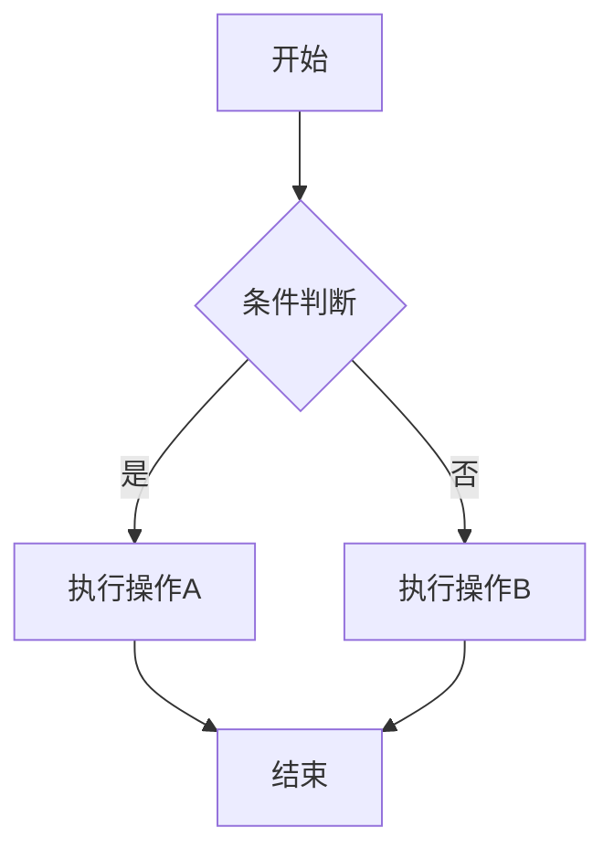

# GFM (GitHub Flavored Markdown) 完整渲染测试文档

> 本文档旨在全面测试 GFM 规范下的各类语法渲染效果，涵盖常见用法与易踩坑场景。

---

## 1. 标题层级测试

# H1 — 一级标题
## H2 — 二级标题
### H3 — 三级标题
#### H4 — 四级标题
##### H5 — 五级标题
###### H6 — 六级标题
####### 这不是标题（超过6个 # 号）

> ⚠️ **踩坑点**：`#######` 七个 `#` 不会渲染为标题，而是普通文本。`#` 与标题文字之间**必须有空格**。

#没有空格的井号不是标题

---

## 2. 强调与内联样式

| 语法 | 效果 | 说明 |
|------|------|------|
| `*斜体*` 或 `_斜体_` | *斜体* | 两种写法均可 |
| `**粗体**` 或 `__粗体__` | **粗体** | 两种写法均可 |
| `***粗斜体***` | ***粗斜体*** | 三个星号 |
| `~~删除线~~` | ~~删除线~~ | GFM 扩展语法 |
| `` `行内代码` `` | `行内代码` | 反引号包裹 |
| `上标/下标` | 不支持原生 HTML 外的方式 | 需用 `<sup>` `<sub>` |

**嵌套测试**：这是 **粗体中包含 *斜体* 和 ~~删除线~~** 的效果

> ⚠️ **踩坑点**：
> - `_word_` 在单词中间不会触发斜体：foo_bar_baz 不会被渲染为斜体
> - `*` 比 `_` 在更多场景下生效
> - 行内代码中的内容**不会被二次解析**：`**这不是粗体**`

---

## 3. 链接与图片

### 3.1 链接

- 普通链接：[GitHub](https://github.com)
- 自动链接：https://github.com
- 尖括号链接：<https://github.com>
- 引用式链接：[示例文字][ref1]
- 隐式引用链接：[GitHub][]
- 带 title 的链接：[GitHub](https://github.com "GitHub 官网")

[ref1]: https://example.com "这是一个引用式链接"
[GitHub]: https://github.com

### 3.2 图片

- 普通图片：
- 引用式图片：![替代文字][imgref]
- 图片链接：[](https://github.com)

[imgref]: https://github.githubassets.com/images/modules/logos_page/Octocat.png

> ⚠️ **踩坑点**：
> - 图片路径中如果含空格需要用 `%20` 编码或尖括号包裹
> - Markdown 不支持直接设置图片大小，需用 HTML：``
> - 相对路径图片在不同平台（GitHub vs 本地预览）表现可能不同

---

## 4. 列表

### 4.1 无序列表

- 第一级
  - 第二级
    - 第三级
      - 第四级
* 星号也可以
+ 加号也可以

### 4.2 有序列表

1. 第一项
2. 第二项
   1. 有序子列表
   2. 有序子列表
3. 第三项

> ⚠️ **踩坑点**：实际渲染时，有序列表的序号以第一个数字为准：
> 1. Apple
> 1. Banana
> 1. Cherry
> 
> 上面三项渲染后会显示为 1, 2, 3，而不是 1, 1, 1。

### 4.3 任务列表（GFM 扩展）

- [x] 已完成任务
- [ ] 未完成任务
- [x] 嵌套任务
  - [x] 子任务 A
  - [ ] 子任务 B
- [ ] 在列表项中使用 **格式化** 和 `代码`

### 4.4 列表中的复杂内容

1. **包含段落**

   列表项中的第二段需要缩进4个空格或1个 Tab。

2. **包含代码块**

   ```python
   def hello():
       print("这是在列表中的代码块")
   ```

3. **包含引用**

   > 这是在列表项中的引用块。
   > 可以多行。

---

## 5. 代码

### 5.1 行内代码

使用 `print("Hello World")` 输出。

包含反引号的行内代码：`` `code` ``（用双反引号包裹）

### 5.2 围栏代码块

```python
# Python 示例
def fibonacci(n: int) -> list[int]:
    """计算斐波那契数列"""
    if n <= 0:
        return []
    a, b = 0, 1
    result = []
    for _ in range(n):
        result.append(a)
        a, b = b, a + b
    return result

print(fibonacci(10))
```

```javascript
// JavaScript 示例
const fetchData = async (url) => {
  try {
    const response = await fetch(url);
    if (!response.ok) throw new Error(`HTTP ${response.status}`);
    return await response.json();
  } catch (error) {
    console.error('Fetch failed:', error);
  }
};
```

```sql
-- SQL 示例
SELECT 
    u.name, 
    COUNT(o.id) AS order_count,
    SUM(o.amount) AS total_amount
FROM users u
LEFT JOIN orders o ON u.id = o.user_id
WHERE u.created_at >= '2024-01-01'
GROUP BY u.id, u.name
HAVING COUNT(o.id) > 5
ORDER BY total_amount DESC
LIMIT 10;
```

```bash
# Shell 示例
for file in *.log; do
    echo "Processing: $file"
    grep -i "error" "$file" | wc -l
done
```

```diff
- 旧版本代码
+ 新版本代码
  未变更代码
```



> ⚠️ **踩坑点**：
> - 语言标识符大小写：`Python` vs `python`，大多数渲染器不区分，但建议小写
> - Mermaid 图需要渲染器支持（GitHub 已原生支持）
> - 代码块内的 HTML 实体 **不会** 被转义：`&amp;` 就是 `&amp;`
> - 代码块内 **不能** 使用 Markdown 语法

---

## 6. 表格（GFM 扩展）

### 6.1 基础表格

| 左对齐 | 居中对齐 | 右对齐 | 默认 |
|:--------|:--------:|-------:|------|
| Apple | 🍎 | ¥5.00 | 水果 |
| Banana | 🍌 | ¥3.50 | 水果 |
| Carrot | 🥕 | ¥2.00 | 蔬菜 |
| 这是一段很长的文字 | 短 | ¥999.99 | 测试 |

### 6.2 表格中的格式化

| 功能 | 语法 | 效果 |
|------|------|------|
| 粗体 | `**text**` | **text** |
| 斜体 | `*text*` | *text* |
| 代码 | `` `code` `` | `code` |
| 链接 | `[text](url)` | [GitHub](https://github.com) |
| 删除线 | `~~text~~` | ~~text~~ |

> ⚠️ **踩坑点**：
> - 表格单元格内 **不能** 换行（使用 `<br>` 替代）
> - 管道符 `|` 需要用 `\|` 转义
> - 表格单元格内不能使用块级元素（如标题、列表、代码块）
> - 分隔行中至少需要3个连字符 `---`，但 `-` 也可以
> - 首尾的管道符 `|` 是可选的

---

## 7. 引用块

> 一级引用
>
> > 二级嵌套引用
> >
> > > 三级嵌套引用
> >
> > 回到二级
>
> 回到一级

> **引用中可以包含各种元素**：
>
> 1. 有序列表
> 2. 第二项
>
> - 无序列表
> - 第二项
>
> ```python
> print("引用中的代码块")
> ```
>
> | 表头1 | 表头2 |
> |-------|-------|
> | 内容1 | 内容2 |

---

## 8. 水平分割线

以下三种写法效果相同：

---

***

___

> ⚠️ **踩坑点**：`---` 如果紧跟在文字后面（中间没有空行），会被解析为**集合链接**（setext heading），而非水平线：
>
> 这会变成H2标题
> ---

---

## 9. HTML 混用

<div align="center">

### 居中的标题（HTML + Markdown）

这是在 HTML 中使用 **Markdown** 渲染

</div>

<details>
<summary>🔽 点击展开折叠内容</summary>

这是折叠区域内的内容：

- 列表项 1
- 列表项 2

```python
print("折叠区域内的代码")
```

| 表格 | 也在 | 折叠区 |
|------|------|--------|
| A | B | C |

</details>

<kbd>Ctrl</kbd> + <kbd>C</kbd> 复制

> ⚠️ **踩坑点**：
> - 在 HTML 块内部，Markdown 语法 **默认不解析**（除非 HTML 块前后有空行，且渲染器支持）
> - `<script>` 和 `<style>` 标签通常会被过滤
> - `<details>` 在 GitHub 上完全支持，但某些编辑器不支持
> - `<kbd>` 标签渲染为键盘按键样式

---

## 10. 脚注（扩展语法）

这是一段包含脚注的文字[^1]，还有另一个脚注[^note]。

[^1]: 这是第一个脚注的内容。
[^note]: 脚注标识符可以使用数字或文字，但渲染时都会变成数字。

> ⚠️ **踩坑点**：脚注语法**不是**标准 GFM 的一部分，不同平台支持程度不同。GitHub 已支持。

---

## 11. 数学公式（GitHub 支持）

行内公式：$E = mc^2$

块级公式：

$$
f(x) = \int_{-\infty}^{\infty} \hat{f}(\xi) e^{2\pi i \xi x} d\xi
$$

$$
\sum_{n=1}^{\infty} \frac{1}{n^2} = \frac{\pi^2}{6}
$$

> ⚠️ **踩坑点**：
> - 行内公式 `$...$` 与 `$` 之间不能有空格（即 `$ x $` 可能不渲染）
> - 块级公式 `$$...$$` 必须独占一行
> - 公式内的 Markdown 语法不生效

---

## 12. Emoji（GFM）

直接使用 Unicode：😀 🎉 🚀 💻 🔥 ⭐ 📝

短代码（GitHub 支持）：`:smile:` → 😄，`:rocket:` → 🚀，`:+1:` → 👍

---

## 13. @提及与 #引用（GitHub 特有）

- 提及用户：@octocat @defunkt
- 引用 Issue：#1 #123
- 引用 PR：!456
- 完整引用：github/feedback#123

> ⚠️ 这些只在 GitHub 平台上可点击跳转，其他 Markdown 渲染器中只是纯文本。

---

## 14. 换行与段落

这是第一段。段落之间需要**至少一个空行**分隔。

这是第二段。在行尾加两个空格  
可以实现行内换行（soft break），而不是新段落。

也可以直接用 `<br>` 标签<br>实现换行。

> ⚠️ **踩坑点**：
> - 很多人不知道行尾双空格的换行方式
> - 连续多个空行只会被渲染为一个段落间距
> - 中文用户常见困惑：中文之间不加空格，但英文/数字与中文之间建议加空格

---

## 15. 转义字符

可转义字符：`` \ ` * _ { } [ ] ( ) # + - . ! | ``

示例：
- `\*这不是斜体\*` → \*这不是斜体\*
- `\# 这不是标题` → \# 这不是标题
- `\[不是链接\]` → \[不是链接\]

> ⚠️ **踩坑点**：反引号 `` ` `` 不能用反斜杠转义，只能用双反引号包裹。

---

## 16. 定义列表（非标准，部分支持）

术语一
: 术语一的定义

术语二
: 术语二的定义
: 术语二的补充定义

> ⚠️ 这不是标准 GFM，大部分平台**不支持**。

---

## 17. 特殊场景与踩坑汇总

### 17.1 连续星号/下划线的歧义

以下写法容易出问题：

- `***bold italic***` → ***bold italic*** ✅
- `**_bold italic_**` → **_bold italic_** ✅
- `*__bold italic__*` → *__bold italic__* ✅  
- `_**bold italic**_` → _**bold italic**_ ✅

### 17.2 链接中的特殊字符

- [链接含括号](https://example.com/path_(test))
- [链接含&符号](https://example.com?a=1&b=2)
- [链接含中文](https://example.com/路径/测试)

### 17.3 列表序号后的标点

1. 用点 `.` — 标准写法
1) 用括号 `)` — GFM 也支持

### 17.4 嵌套引用与列表混排

> - 引用中的列表
>   - 嵌套列表
>   - 嵌套列表
>
> 1. 引用中的有序列表
> 2. 第二项

### 17.5 空白字符

- Tab 缩进：制表符在代码块中保留，在普通文本中可能被转换为空格
- 不间断空格（NBSP）：`&nbsp;` 在需要精确控制空格时使用
- 零宽空格：`` 用于在长连续字符串中允许断行

### 17.6 超长行与自动换行

这是一段非常长的文字用来测试Markdown渲染器如何处理超长行的自动换行机制。在标准Markdown中，源文件中的换行符会被合并为一个空格（除非行尾有两个空格），因此即使源码中分了多行书写，最终渲染结果仍然是连续的段落文字，这一点对于习惯了所见即所得编辑器的用户来说可能是最大的意外之一。

### 17.7 中文排版特殊问题

中文与English和Number123之间的间距问题，推荐写法是 `中文 English 123 中文`，即在中西文之间手动加一个空格。这不是 Markdown 的问题，而是排版美学问题。部分渲染器（如少数派、VuePress）会自动处理 `pangu.js` 间距。

---

## 18. 综合实战示例

<details>
<summary>📦 点击展开：一份完整的项目 README 示例</summary>

# 🚀 Awesome Project

[](#)
[](#)
[](#)

## 📖 简介

**Awesome Project** 是一个 *高性能*、~~低延迟~~ 零延迟的分布式框架。

## ✨ 特性

- [x] 支持水平扩展
- [x] 内置负载均衡
- [ ] Web 管理界面（开发中）
- [ ] 插件系统

## 🚀 快速开始

```bash
# 安装
npm install -g awesome-project

# 初始化
awesome init my-project

# 启动
cd my-project && awesome start
```

## 📊 性能对比

| 框架 | QPS | 延迟 (ms) | 内存 (MB) |
|:-----|----:|----------:|----------:|
| **Awesome** | **150,000** | **0.8** | **128** |
| Framework A | 120,000 | 1.2 | 256 |
| Framework B | 95,000 | 2.5 | 512 |

## 📐 架构

$$
\text{Throughput} = \frac{\text{Requests}}{\text{Time}} \times \text{Workers}
$$

## 📝 更新日志

> **v2.0.0** (2024-06-01)
> - 🎉 全新架构重写
> - 🐛 修复了内存泄漏问题
> - ⚡ 性能提升 ~~30%~~ 50%

---

<sub>© 2024 Awesome Team. All rights reserved.</sub>

</details>

---

## 19. 渲染器兼容性速查表

| 语法 | GitHub | VS Code | Typora | Obsidian | 微信公众号 |
|------|:------:|:-------:|:------:|:--------:|:----------:|
| 标题 | ✅ | ✅ | ✅ | ✅ | ✅ |
| 粗体/斜体 | ✅ | ✅ | ✅ | ✅ | ✅ |
| 删除线 | ✅ | ✅ | ✅ | ✅ | ❌ |
| 表格 | ✅ | ✅ | ✅ | ✅ | ⚠️ |
| 任务列表 | ✅ | ✅ | ✅ | ✅ | ❌ |
| 围栏代码块 | ✅ | ✅ | ✅ | ✅ | ⚠️ |
| 脚注 | ✅ | ⚠️ | ✅ | ✅ | ❌ |
| 数学公式 | ✅ | ❌ | ✅ | ✅ | ❌ |
| Mermaid | ✅ | ❌ | ✅ | ✅ | ❌ |
| Emoji | ✅ | ⚠️ | ✅ | ✅ | ⚠️ |
| `<details>` | ✅ | ⚠️ | ❌ | ✅ | ❌ |
| `@` 提及 | ✅ | ❌ | ❌ | ⚠️ | ❌ |
| 定义列表 | ❌ | ❌ | ⚠️ | ❌ | ❌ |

> ✅ 完全支持 | ⚠️ 部分支持 | ❌ 不支持

---

<details>
<summary>📋 踩坑清单（点击展开）</summary>

### 🔴 严重踩坑

1. **`#` 后不加空格** → 不是标题
2. **`---` 紧跟文字** → 变成 Setext 标题而非分割线
3. **表格内换行** → 不支持，需用 `<br>`
4. **HTML 块内 Markdown** → 默认不解析
5. **`$` 与公式间有空格** → 行内公式不渲染
6. **有序列表序号** → 以第一个数字为准，后续自动递增
7. **行内代码内写 Markdown** → 不解析，是纯文本
8. **连续空行** → 只保留一个段落间距
9. **图片/链接路径含空格** → 需 URL 编码
10. **中文引号与链接** → 全角括号 `（）` 不是合法链接括号

### 🟡 注意事项

1. 不同渲染器对 GFM 扩展语法支持程度不同
2. 发布到不同平台前，务必做渲染预览
3. 使用 Linter 工具（如 `markdownlint`）检查语法
4. 图片建议使用图床，避免相对路径依赖
5. 长文档建议使用 `[TOC]` 或手动目录

</details>

---

*本文档最后更新：2026-06-05*

*如果觉得有用，请 ⭐ Star 支持！*